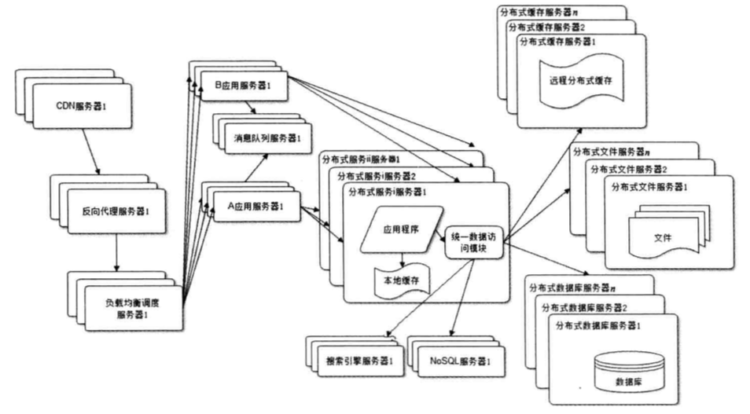

# 购物商城项目

购物商城是一个大型电商网站，一共有2个平台

1. 电商平台：负责售卖商品
2. 内容管理后台：负责编辑商品、调整电商平台首页的内容。

2个平台的功能如下

电商平台

1. 首页展示的商品，是从内容管理平台配置的
2. 搜索商品，并展示结果
3. 热门数据需要缓存在redis中，有变化时需要更新redis
4. 用户登录后可以购买商品，并查看对应的订单

内容管理后台

1. 商品的增删查改
2. 配置首页的商品内容
3. 一键将商品信息导入到索引，商品更新后自动更新索引
4. 管理订单状态

## 项目架构

因为购物商城是一个大型电商网站，所以采用分布式架构



> 网站架构参考书籍《大型网站技术架构-核心原理与案例分析》

购物商城架构(SOA架构)


电商平台相关的表现层包括

- 门户系统(首页)
- 搜索系统
- 单点登录系统
- 商品详情

内容管理后台的表现层是

- 后台管理系统

## 项目结构

项目模块使用maven管理。所有项目都继承 mall-parent 项目，所有项目的通用工具类都放在 mall-common 项目。整个购物商场项目结构如下

```
- mall-parent
| - mall-common
| - mall-xxx-web        表现层
| - mall-xxx                服务层
| | - mall-xxx-interface
| | - mall-xxx-service
| ...
| - mall-dao                持久层
| | - mall-dao-pojo
| | - mall-dao-mapper
```

表现层：提供展示页面、调用合适的服务。不处理业务逻辑。

服务层：处理业务逻辑，封装处理结果。

持久层：连接数据库，查询或存储数据。

使用dubbo作为分布式框架，沟通表现层和服务层

## 技术选型

前端

- HTML、CSS、JavaScript、jQuery
- JSP、JSTL(动态页面)
- Bootstrap(商城页面)、EasyUI(后台页面)

后端

- SSM框架（Spring、Spring MVC、Mybatis）
- Solr（搜索）
- dubbo（分布式服务框架）
- RabbitMQ（消息队列）
- FreeMarker（网页静态化）

服务器

- FastDFS（图片服务器）
- Nginx（反向代理服务器）
- Tomcat（Servlet容器）

数据库

- MySQL
- Redis（缓存服务器）
- MyCat（数据库中间件）

开发工具

- Eclipse
- Maven
- JDK

[更详细的技术需求文档](doc/购物商城_技术文档_v0.1.md)