# 购物商城项目

## 项目概述

购物商城是一个大型电商网站，一共有2个平台

1. 电商平台：负责售卖商品
2. 内容管理后台：负责编辑商品、调整电商平台首页的内容。

2个平台的功能如下

电商平台

1. 首页展示的商品，是从内容管理平台配置的
2. 搜索商品，并展示结果
3. 热门数据需要缓存在redis中，有变化时需要更新redis
4. 用户登录后可以购买商品，并查看对应的订单

内容管理后台

1. 商品的增删查改
2. 配置首页的商品内容
3. 一键将商品信息导入到索引，商品更新后自动更新索引
4. 管理订单状态

### 项目架构

购物商城架构(SOA架构)

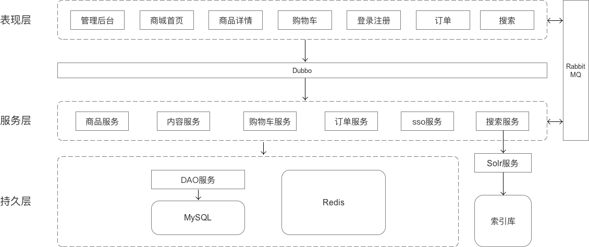

电商平台相关的表现层包括

- 门户系统(首页)
- 搜索系统
- 单点登录系统
- 商品详情

内容管理后台的表现层是

- 后台管理系统

### 项目结构说明

项目模块使用maven管理。所有项目都继承 mall-parent 项目，所有项目的通用工具类都放在 mall-common 项目。整个购物商场项目结构如下

```
- mall-parent
| - mall-common
| - mall-xxx-web		表现层
| - mall-xxx				服务层
| | - mall-xxx-interface
| | - mall-xxx-service
| ...
| - mall-dao				持久层
| | - mall-dao-pojo
| | - mall-dao-mapper
```

表现层：提供展示页面、调用合适的服务。不处理业务逻辑。

服务层：处理业务逻辑，封装处理结果。

持久层：连接数据库，查询或存储数据。

使用dubbo作为分布式框架，沟通表现层和服务层

### 技术选型

前端

- HTML、CSS、JavaScript、jQuery
- JSP、JSTL(动态页面)
- Bootstrap(商城页面)、EasyUI(后台页面)

后端

- SSM框架（Spring、Spring MVC、Mybatis）
- Solr（搜索）
- dubbo（分布式服务框架）
- RabbitMQ（消息队列）
- FreeMarker（网页静态化）

服务器

- FastDFS（图片服务器）
- Nginx（反向代理服务器）
- Tomcat（Servlet容器）

数据库

- MySQL
- Redis（缓存服务器）

- MyCat（数据库中间件）

开发工具

- Eclipse
- Maven
- JDK

## 商品管理模块

模块亮点

1. 商品分页展示
2. 搭建fastDFS图片服务器统一管理上传的图片
3. 当有商品被修改时，使用RabbitMQ告知其他服务（如，索引服务、商品详情）

核心需求

1. 在内容管理后台实现商品的增删查改。
2. 非登录用户不能访问

模块结构

```
- mall-parent
| - mall-common        工具
| - mall-manager-web   表现层
| - mall-manager       服务层
| | - mall-manager-interface
| | - mall-manager-service
| - mall-dao           持久层
| | - mall-dao-pojo
| | - mall-dao-mapper
```

### 数据库设计

商品表

商品的属性：商品ID、商品标题、商品价格、库存、商品图片、分类ID、是否下架、创建时间、更新时间

```sql
CREATE TABLE `mall_item` (
  `id` bigint(20) NOT NULL COMMENT '商品id，同时也是商品编号',
  `title` varchar(100) NOT NULL COMMENT '商品标题',
  `price` bigint(20) NOT NULL COMMENT '商品价格，单位为：分',
  `num` int(10) NOT NULL COMMENT '库存数量',
  `image` varchar(500) DEFAULT NULL COMMENT '商品图片',
  `cid` bigint(10) NOT NULL COMMENT '所属类目，叶子类目',
  `status` tinyint(4) NOT NULL DEFAULT '1' COMMENT '商品状态，1-正常，2-下架',
  `created` datetime NOT NULL COMMENT '创建时间',
  `updated` datetime NOT NULL COMMENT '更新时间',
  PRIMARY KEY (`id`),
  FOREIGN KEY (`cid`) REFERENCES `mall_item_cat` (`id`) 
);
```

商品描述

商品描述属性：商品ID、创建时间、更新时间、商品描述

```sql
CREATE TABLE `mall_item_desc` (
  `item_id` bigint(20) NOT NULL COMMENT '商品ID',
  `item_desc` text COMMENT '商品描述',
  `created` datetime DEFAULT NULL COMMENT '创建时间',
  `updated` datetime DEFAULT NULL COMMENT '更新时间',
  PRIMARY KEY (`item_id`)
);
```

分类表

分类的属性：分类ID、父分类ID、分类名、分类状态、排序号、是否是父分类、创建时间、更新时间

```sql
CREATE TABLE `mall_item_cat` (
  `id` bigint(20) NOT NULL AUTO_INCREMENT COMMENT '类目ID',
  `parent_id` bigint(20) DEFAULT NULL COMMENT '父类目ID=0时，代表的是一级的类目',
  `name` varchar(50) DEFAULT NULL COMMENT '类目名称',
  `status` int(1) DEFAULT '1' COMMENT '状态。可选值:1(正常),2(删除)',
  `sort_order` int(4) DEFAULT NULL COMMENT '排列序号，表示同级类目的展现次序，如数值相等则按名称次序排列。取值范围:大于零的整数',
  `is_parent` tinyint(1) DEFAULT '1' COMMENT '该类目是否为父类目，1为true，0为false',
  `created` datetime DEFAULT NULL COMMENT '创建时间',
  `updated` datetime DEFAULT NULL COMMENT '创建时间',
  PRIMARY KEY (`id`),
  FOREIGN KEY (`parent_id`) REFERENCES `mall_item_cat` (`id`) 
) COMMENT='商品类目';
```

### 添加商品

需求原型

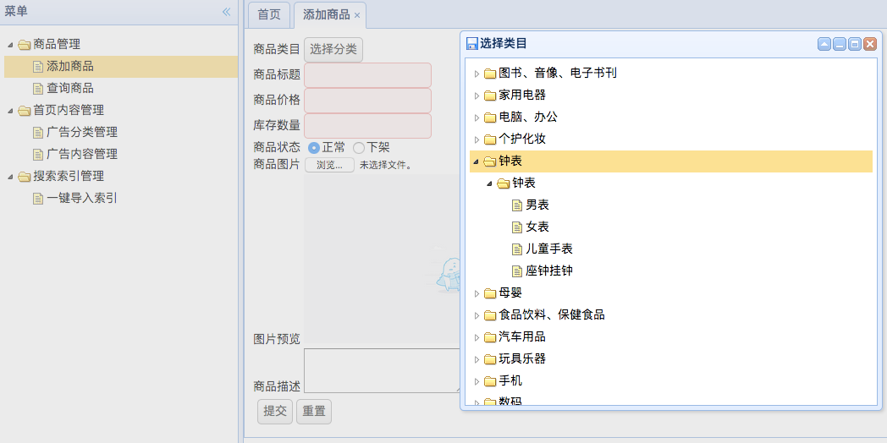

需求描述

1. 点击“添加商品”跳转到添加商品页面
2. 选择分类
   1. 以树形结构展示分类结构
   2. 从数据库中取出一级分类，展开树节点时，再依次取出对应的二级分类
   3. 选中最细分的分类作为商品分类
3. 上传图片（将图片上传到图片服务器）
   1. 上传图片并显示图片预览
   2. 获取上传的图片
   3. 将图片存储到图片服务器上
   4. 获得图片地址并存储到数据库
4. 添加商品到数据库。
5. 添加成功后，从索引中新增该商品的索引，新增该商品详情的静态页面。

功能结构设计

```
表现层 mall-manager-web 

- 前端页面
	- home.jsp 						侧边栏，添加商品入口
	- item-add.jsp 				添加商品
- Controller
	- ItemController
		- addItem() 				添加商品
	- PageController
		- toPage() 					跳转到对应的页面
	- ItemCatController
		- getItemCatList() 	获取某分类的子分类

服务层 mall-manager

- mall-manager-interface	商品服务接口
	- ItemService
		- addItem() 添加商品到数据库，通知索引服务添加的商品id
		- addItemDesc() 添加商品描述到数据库
	- ItemCatService
		- getItemCatList() 根据父分类id获取子分类，以easyui树节点要求的json格式返回
- mall-manager-service	商品服务接口的实现

持久层 mall-dao (因持久层基本不变，后续无特殊情况，会被省略)

- mall-dao-pojo 服务层使用的类
	- MallItem.java 			商品类
- mall-dao-mapper		持久层（由mybatis逆向工程自动生成）
	- MallItemMapper
	- MallItemDescMapper

工具服务 mall-common

- pojo 常用对象的类
  - EasyUITreeNode EasyUI的树节点对应的对象
- util 工具类
  - FastDFSClient 图片上传工具
```

代码逻辑

1. 使用form封装添加的商品数据。form类型选择"multipart/form-data"
2. Controller接收数据，并调用Service服务将数据添加到数据库
  1. ItemService将商品添加到数据库、将图片上传到图片服务器
  2. 使用RabbitMQ通知搜索服务被添加的商品id。
3. 告知前端操作结果

测试用例

1. 点击“添加商品”，
   1. 点击“选择分类”，点击某个分类，查看分类是否加载正确
2. 添加成功后，
   1. 查看图片服务器内，图片是否添加成功；
   2. 查看数据库内商品是否添加成功，参数是否正确；
   3. 查看商品是否被添加进索引。

### 查询商品

需求原型

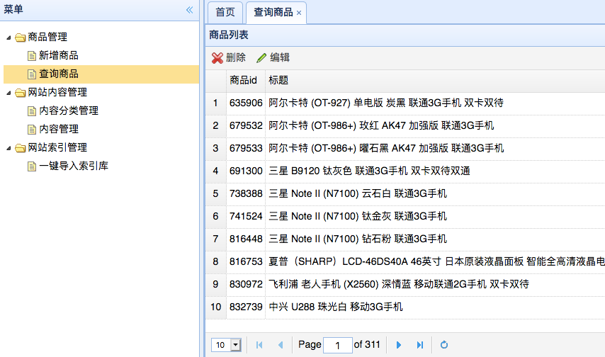

需求描述

1. 点击“查询商品”，跳转到商品列表页面。页面显示10条
2. 点击第x页、上一页、下一页等，能显示对应的数据

功能结构设计

```
表现层 mall-manager-web

- 前端页面
	- home.jsp 					商品列表页入口
	- item-list.jsp 		商品列表页，可分页展示商品
- Controller
	- ItemController
		- getItemList() 	获取商品列表并展示在页面上
	- PageController
		- toPage()				跳转到对应的页面

服务层 mall-manager

- mall-manager-interface	
	- ItemService
		- getItemList       按页获取商品列表
- mall-manager-service	接口的实现

工具服务 mall-common

- pojo 常用对象的类
	- EasyUIDataGridResult EasyUI的datagrid对应的对象
```

代码逻辑

1. 页面加载时，向Controller传递页面参数(第几页，每页显示几行)
2. Controller调用Service，获得相关的数据
   1. 使用PageHelper获取该页对应的数据(也可以修改Mapper来获取分页数据)
3. 将数据传递给前端

测试用例

1. 点击“查询商品”看是否显示正确
2. 点击第x页等看是否显示正确


### 删除商品

需求原型

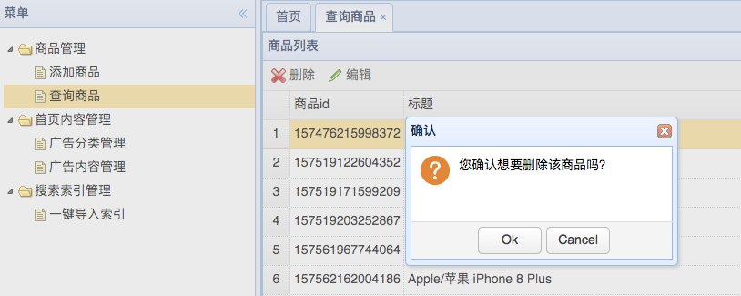

需求描述

1. 未选中商品时点击“删除”，提示“请先选中一个商品”。
2. 在商品列表页，选中一个商品，点击工具条上的“删除”按钮
3. 提示“是否确认删除”，点击是，删除商品，并刷新页面。点击否，不做操作。
4. 删除成功后，从索引中删除该商品的索引，删除该商品详情的静态页面。

功能结构设计

```
表现层 mall-manager-web

- 前端页面
	- item-list.jps 	商品列表页，提供删除商品的交互
- Controller
	- ItemController 
		- deleteItem() 	根据id删除商品

服务层 mall-manager

- mall-manager-interface
	- ItemService
		- deleteItem() 			根据id删除商品
- mall-manager-service	接口的实现
```

代码逻辑

1. 点击“确定删除”后，将商品id传给Controller
2. Controller调用Service提供的服务，删除对应商品
  1. Service删除对应商品
  2. 通知索引服务被删除的商品id
3. 将操作状态返回给前端

测试用例

1. 选中某个商品，删除该商品，查看数据库内是否删除

### 编辑商品

需求原型

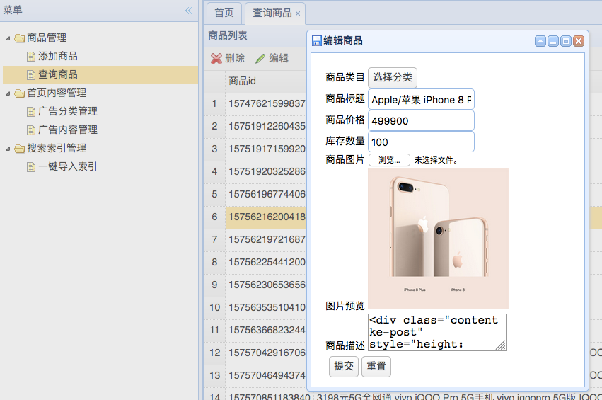

需求描述

1. 未选中商品时点击“编辑”，提示“请先选中一个商品”。
2. 在商品列表页，选择一个商品，点击“编辑”按钮
3. 显示编辑弹框，字段内自动填充商品信息
4. 点击“提交”修改商品信息，提示修改成功(或失败)，并刷新商品列表页
5. 修改成功后，更新该商品的索引，更新该商品详情的静态页面。

功能结构设计

```
表现层 mall-manager-web

- 前端页面
	- item-list.jps 	商品列表页，提供编辑商品的入口
	- item-edit.jsp 	编辑商品页面
- Controller
	- ItemController
		- updateItem() 	根据id更新商品

服务层 mall-manager

- mall-manager-interface
	- ItemService
    - updateItem() 			更新商品
    - updateItemDesc()	更新商品详情
- mall-manager-service	接口的实现
```

备注：更新商品描述，要用updateByPrimaryKeyWithBLOBs方法。

代码逻辑

1. 选中某个商品，点击“编辑”按钮时
	1. 将商品数据回传到编辑页面
	2. 将商品描述数据从后端取回，显示在编辑页面
2. 更新商品信息后，点击“提交”，将数据传给Controller
3. Controller接收数据，调用Service将商品数据更新到数据库
  1. 更新商品到数据库
  2. 通知其他服务被更新的商品id
4. 返回操作状态给前端

测试用例

1. 选中某个商品，点击“编辑”按钮，查看页面数据是否显示正确
2. 点击“提交”，查看商品是否能正常更新到数据库。索引和商品详情页是否更新
3. 构造一个商品id不存在的商品并提交，查看返回信息是否正确（提示商品不存在）

### 访问限制

需求描述

1. 只有登录用户才能访问管理后台的所有页面，非登录用户访问时，跳转到登录页面。
2. 登录成功后，自动跳转到管理后台首页
3. 登录超时时间为30分钟，30分钟后需要重新登录

模块结构

```
表现层 mall-manager-web

- 前端页面
	- index.jsp 登录页面
- Controller
	- PageController 处理登录逻辑
- Interceptor
	- LoginInterceptor 拦截器

服务层 mall-manager

- mall-manager-interface
	- ManagerService
		- login() 处理登录逻辑
		- isLogin() 判断是否登录
- mall-manager-service 接口的实现
```

代码逻辑

1. 访问某后台页面，进入拦截器。从cookie中获取token，调用managerService的isLogin服务，查看用户是否登录成功。
	1. 未登录，则跳转到登录页面。
	2. 已登录，则放行。
2. 登录页面，用户名和密码不能为空，输入后发送到后端的PageController
	1. controller调用Service服务的login方法
		1. 获取cookie中的token，传给login方法
		2. 判断用户是否登录成功，登录成功，则
			1. 生成用户token，存入登录用户表map，键值对为（token，当前时间）。
			2. 用户原来有token，则从map中删除
			3. 将用户token封装到结果中，返回
		3. 登录失败，则返回登录失败的结果
	2. 返回Result到controller，Result.data存分配给用户的token
		1. 登录成功，设置Cookie存储token
		2. 登录不成功，直接返回结果
3. 登录成功，跳转到管理后台首页；登录不成功，提示错误信息。

测试用例

1. 未登录，访问管理后台，看是否正确跳转
2. 登录后，再次登录，看token是否发生改变。访问管理后台，看是否可以访问成功
3. 30分钟后，再次访问管理后台，看是否跳转到登录页

## 商城首页模块

模块亮点

1. 前端展示内容可人工配置
2. 使用redis缓存热点数据，加快访问速度

核心需求

1. 商城首页由各个广告位组成。使用一个轮播图作为演示的广告位，展示后台配置的广告内容。
2. 管理后台配置广告位类型、广告位内容。
   1. 广告类型的增删查改
   2. 广告内容的增删查改
3. 广告类型、广告内容缓存在redis数据库。
   1. 有缓存时，从redis里取数据
   2. 无缓存时，从mysql里取数据
   3. 广告内容有更新时，需删除redis中对应的数据

模块结构

```
- mall-parent
| - mall-common        工具
| - mall-portal-web    表现层(商城首页)
| - mall-manager-web   表现层(内容管理后台)
| - mall-content			 服务层(内容服务)
| | - mall-content-interface
| | - mall-content-service
| - mall-dao           持久层
| | - mall-dao-pojo
| | - mall-dao-mapper
```

### 数据库设计

广告分类

属性：广告分类ID、父节点ID、标题、状态、排序号、是否是父节点、创建时间、更新时间

```sql
create table `mall_content_cat`(
  id bigint(20) not null AUTO_INCREMENT COMMENT '类目ID',
  parent_id bigint(20) DEFAULT NULL COMMENT '父类目ID=0时，代表的是一级的类目',
  name varchar(20) DEFAULT NULL COMMENT '分类名称',
  sort_order int(4) DEFAULT NULL COMMENT '排列序号，表示同级类目的展现次序，如数值相等则按名称次序排列。取值范围:大于零的整数',
  is_parent tinyint(1) DEFAULT '1' COMMENT '该类目是否为父类目，1为true，0为false',
  created datetime DEFAULT NULL COMMENT '创建时间',
  updated datetime DEFAULT NULL COMMENT '更新时间',
  PRIMARY KEY (`id`),
  FOREIGN KEY (`parent_id`) REFERENCES `mall_content_cat` (`id`)
);
```

备注：广告分类是树形结构。设置根节点时，需要关闭外键检查，将parent_id设为0。

广告内容

属性：内容id、内容分类id、标题、子标题、图片1、图片2、跳转链接、描述、创建时间、更新时间

```sql
create table `mall_content`(
  id bigint(20) not null AUTO_INCREMENT COMMENT '类目ID',
  cat_id bigint(20) not null COMMENT '父类目ID=0时，代表的是一级的类目',
  title varchar(200) DEFAULT NULL COMMENT '内容标题',
  title_desc varchar(500) DEFAULT NULL COMMENT '标题描述',
  url varchar(500) DEFAULT NULL COMMENT '链接',
  pic varchar(300) DEFAULT NULL COMMENT '图片绝对路径',
  created datetime DEFAULT NULL COMMENT '创建时间',
  updated datetime DEFAULT NULL COMMENT '更新时间',
  PRIMARY KEY (`id`),
  FOREIGN KEY (`cat_id`) REFERENCES `mall_content_cat` (`id`)
);
```

首页广告内容的 Redis 缓存

- 数据结构 --- hset
- key --- TBCONTENT_KEY
- filed --- 广告内容分类id
- value --- 广告内容

### 后台-广告分类列表

需求原型

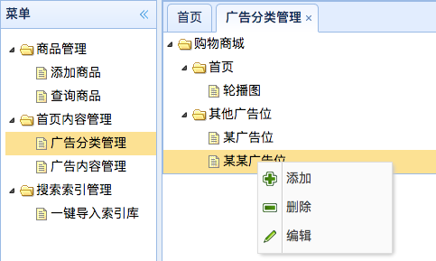

需求描述

1. 点击“广告分类管理”，从数据库中取出广告分类，以树形结构展示
2. 点击父节点，会获取子节点
3. 右击节点，呼出菜单，菜单项：添加、删除、编辑
	1. 点击添加，会在该节点下添加子内容分类，同时该节点变为父节点
	2. 点击删除，如果是子节点，且节点下没有广告内容时，则会删除；否则提示删除失败。删除所有结点后，父节点变为叶子节点。
	3. 点击编辑，可以修改内容分类的名称

功能结构

```
表现层 mall-manager-web

- 前端
	- home.jsp 内容分类列表入口
	- content-cat.jsp 操作内容分类
- Controller
	- ContentCatController
		- getContentCatList()
		- addContentCat()
		- deleteContentCat()
		- updateContentCat()

服务层 mall-content

- mall-content-interface
	- ContentCatService
		- getContentCatList()
		- addContentCat()
		- deleteContentCat()
		- updateContentCat()
- mall-content-service 接口实现
```

代码逻辑

1. 在数据库内预先填充好根节点，设置parent_id=0。
2. 点击展开某节点时，将节点id传给Controller。默认传递的节点id为0
3. Controller调用Service获得子节点信息，传递给前端。
4. 选中某个节点，右击选择“添加”时，
  1. 节点id默认设置成0。将添加的节点信息传递给Controller。
  2. Controller调用Service将节点添加到数据库，并将节点id返回给前端
    1. Service添加节点到数据库。如果父节点是叶子节点，需要将父节点修改为非叶子结点。
  3. 前端更新节点的id
5. 选中某个节点，右击选择“删除”时，
  1. 将节点id传给Controller，Controller调用Service并返回操作状态。
  2. Service删除节点
    1. 如果节点是父节点，则提示无法删除。
    2. 如果是叶子结点，则删除。若删除后，该节点的父节点没有子节点了，则将父节点设置为叶子结点。
  3. 如果删除成功，前端删除树中对应的节点信息。
6. 选中某个节点，右击选择“编辑”时，
  1. 将节点id和节点name传递给Controller
  2. Controller调用Service更新节点信息

测试用例

1. 没有广告分类时，测试根节点是否显示正确
2. 在根节点下添加子节点，在子节点下再添加子节点，检查显示是否正确，数据库内是否添加成功。
3. 删除父节点，检查是否无法删除。
4. 删除叶子结点(父节点只有一个叶子结点)，检查是否删除成功，父节点是否变为叶子结点。
5. 删除叶子结点(父节点有2个及以上个叶子结点)，检查是否删除成功。
6. 编辑某结点，检查是否更新成功。

### 后台-广告内容管理

需求原型

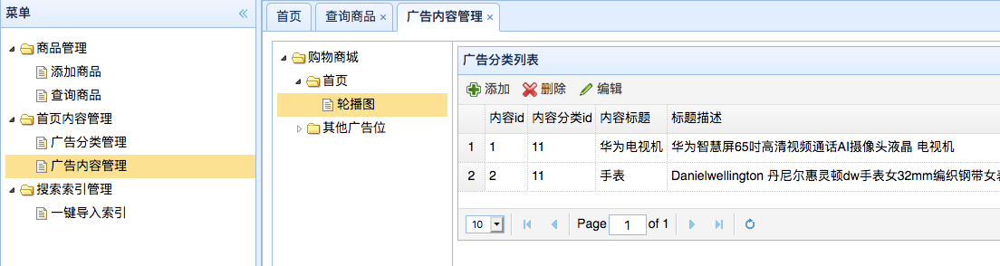

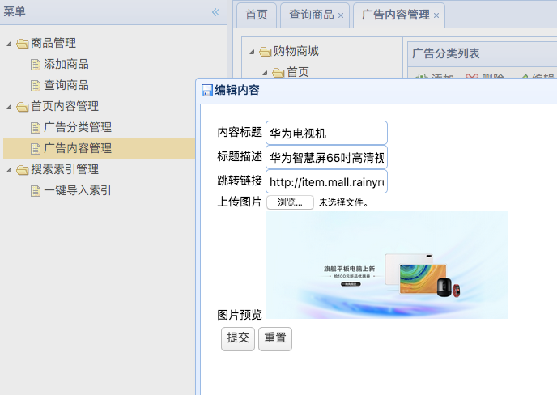

需求描述

1. 点击“广告内容管理”，右侧显示广告分类的树，点击展开广告分类树，选中叶子结点时，右侧显示对应的内容列表。
2. 内容列表展示的字段有：广告内容id、广告分类ID、广告标题、广告描述、图片、跳转链接、更新时间、创建时间
3. 功能栏上有“添加”、"删除"、"修改"的功能。
   1. 选中一条广告，点击以上按钮，可进入对应的功能页面
   2. 未选择广告，点击以上按钮，提示“先选中一条内容”
4. 编辑页面上可以选择：广告标题、广告描述、图片、跳转链接
5. 配置成功后，刷新首页即可看到配置的内容

功能结构

```
表现层 mall-manager-web

- 前端
	- content-list.jsp 内容列表
	- content-edit.jsp 内容编辑页面 
- Controller
	- ContentController
		- getContentList()
		- saveContent() 添加或更新广告内容
		- deleteContent()

服务层 mall-content

- mall-content-interface
	- ContentService
		- getContentList()
		- addContent()
		- deleteContent()
		- updateContent()
- mall-content-service 接口的实现
```

代码逻辑

1. 查询广告内容列表
  1. 选中某广告分类时，向Controller传递分类的id
  2. Controller查询Service，获得广告内容列表
  3. 将广告内容展示在页面上
2. 添加or编辑广告内容
  1. 获取广告分类的id，和填写的广告内容通过form表单提交到Controller
  2. Controller根据是否有内容id，判断是添加还是更新，调用Service处理广告内容
  3. 返回操作状态到前端。添加成功，则刷新页面，展示添加到广告内容

测试用例

1. 查看内容列表是否显示正确
2. 查看增删改是否正确

### 前台-商城首页

需求原型

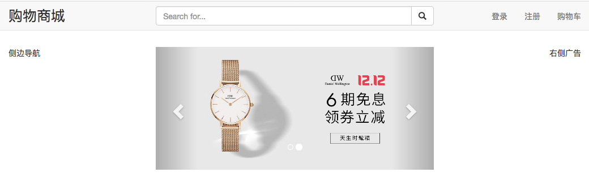

需求描述

1. 商城首页的轮播图广告位，展示后台配置的广告内容
2. 点击后跳转到配置的链接指向的页面。
3. 广告内容默认从redis中获取数据，redis中没有时，从数据库获取。
4. 展示最新上传的8个商品

模块结构

```
表现层 mall-portal-web

- 前端页面
  - index.jsp 商城首页
- Controller
  - portalController 处理首页发生的各种请求
    - showAdCarousel() 展示首页轮播图
    - getLatestItem() 获取最新上传的8个商品

服务层 mall-content

- mall-content-interface
  - ContentService
    - getContent() 根据内容id提供内容
- mall-content-service 接口的实现

服务层 mall-manager

- mall-manager-interface
  - ItemService
    - getLatestItem() 获取最新上传的8个商品
- mall-manager-service 接口的实现
```

代码逻辑

1. 获取轮播图内容
  1. 向后端请求轮播图的内容
  2. ContentController接收到请求，调用contentService获取内容
      1. contentService判断缓存中是否有数据
          1. 有，取缓存中的json数据，并转换成对象
          2. 无，从数据库取数据，并加入到缓存
  3. 将内容返回到前端
2. 获取最新商品内容
  1. 向后端请求最新商品信息，默认请求8条
  2. ItemService从数据库中查出最新的8条商品信息
  3. 返回给前端，在页面上展示
3. content增删改时，删除content对应的contentCategory的缓存

测试用例

1. 访问首页，数据是从数据库获取。
2. 再次访问首页，数据从redis获取。
3. 修改轮播图content内容，再访问首页，数据从数据库获取。再次访问，从redis获取
4. 删除轮播图content内容，再访问首页，数据从数据库获取。再次访问，从redis获取
5. 添加轮播图content内容，再访问首页，数据从数据库获取。再次访问，从redis获取

## 商品详情

模块亮点

1. 使用freemarker生成静态页面
2. 监听商品服务，当商品被修改时，更新freemarker生成的页面。

核心需求

1. 展示详情页的内容
2. 商品被增删改后，详情页显示更新后的内容。

模块结构

```
表现层 mall-item-web

- 页面
    - item.ftl 商品详情页模板
- listener
    - ItemChangedMessageListener 收到RabbitMQ发送的消息，生成商品详情页
        - onMessage() 监听消息
        - generateItem 生成商品详情页

服务层 mall-manager

- mall-manager-interface
    - ItemService
        - getItemById()
- mall-manager-service 接口的实现
```

需求原型


需求描述

1. 在首页、搜索结果页等页面，点击商品模块，进入商品详情页
2. 商品详情页展示的内容有：商品标题、商品图片、商品id、商品价格、商品描述。可以选择商品数量。有“添加到购物车”的选项。
3. 商品被增删改后，详情页显示更新后的内容。

处理逻辑

1. 访问商品详情页，直接获取Nginx上的静态页面。
2. 当商品增删改时，通过RabbitMQ发送商品id。
3. mall-item-web模块，监听RabbitMQ的消息
   1. 增改商品时，生成新的静态页面
   2. 删除商品时，删除静态页面

测试

1. 点击首页、搜索结果页的商品模块，跳转到商品详情页，检查页面显示内容是否正确
2. 在商品管理页面，增删改商品，查看对应的静态页面是否修改

## 搜索模块

核心需求

1. 在搜索框内输入搜索词，在商品标题、商品描述、分类里查找，给出相关的商品列表，分页展示。

模块亮点

1. 使用Solr实现全文检索的功能
2. 使用自定义的异常处理器，处理搜索服务抛出的异常
3. 使用RabbitMQ监听商品修改的消息，自动更新索引

模块结构

```
- 表现层
  - mall-portal-web 商城首页，有搜索框
  - mall-search-web 搜索结果页
- 服务层
  - mall-search 搜索服务的聚合工程
      - mall-search-service
      - mall-search-interface
  - Solr 服务
- 持久层
  - mall-dao
```

### 索引设计

managed-schema 配置

域：商品id、商品标题、商品卖点、价格、图片、分类、描述

```xml
<field name="id" type="string" indexed="true" stored="true" required="true" multiValued="false" /> 
<field name="title" type="text_ik" indexed="true" stored="true" />
<field name="price" type="plong" indexed="true" stored="true" />
<field name="image" type="string" indexed="false" stored="true" />
<field name="category_name" type="string" indexed="true" stored="true" />
<field name="item_desc" type="text_ik" indexed="true" stored="true" />

<filed name="item_keywords" type="text_ik" multiValued="true" indexed="true" stored="false" />
<copyField source="title" dest="item_keywords" />
<copyField source="category_name" dest="item_keywords" />
<copyField source="item_desc" dest="item_keywords" />
```

添加中文分词器

```xml
<!-- ik分词器 -->
<fieldType name="text_ik" class="solr.TextField">
    <!-- 索引分词器 -->
    <analyzer type="index" isMaxWordLength="false" class="org.wltea.analyzer.lucene.IKAnalyzer"/>
    <!-- 查询分词器 -->
    <analyzer type="query" isMaxWordLength="true" class="org.wltea.analyzer.lucene.IKAnalyzer"/>
</fieldType>
```

### 搜索功能

需求原型

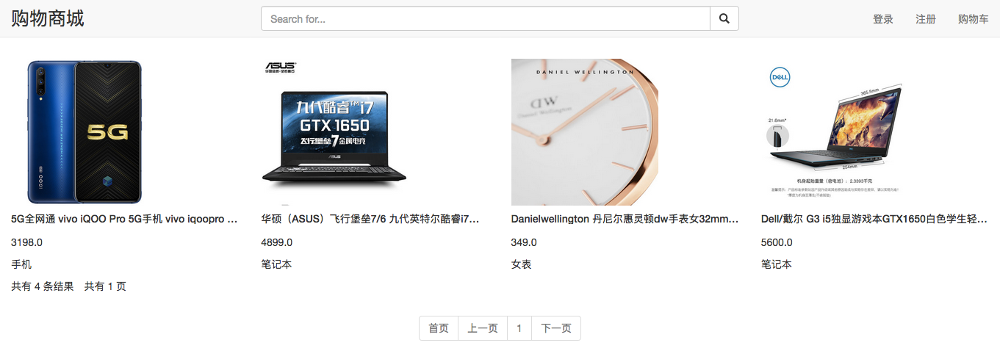

需求描述

页面展示内容

1. 搜索功能(前台)
  1. 在搜索框内输入关键词，点击“搜索”按钮，跳转到搜索结果页
  2. 搜索结果页分页显示搜索结果，每页显示12条商品。底部显示共有多少条搜索结果，共有几页。
  3. 搜索结果页的商品，展示的内容：商品标题、价格、商品图片、商品分类。
  4. 点击第x页，能够跳转到对应的搜索结果页
2. 索引功能(后台)
  1. 点击搜索索引管理模块的“一键导入索引”按钮，可以将数据库中的所有商品，导入到索引库
  2. 当商品有增删改时，会自动更新对应的索引。

功能结构

```
表现层 mall-search-web

- 前端
    - header.jsp 搜索输入框
    - search.jsp 搜索结果页
- Controller
    - SearchController
        - search() 处理搜索词，查询搜索结果

服务层 mall-search

- mall-search
  - mall-search-interface
        - searchService
            - search() 查询结果
            - updateIndex() 更新搜索索引
            - updateSearchItemById() 更新某商品的索引
    - mall-search-service 接口的实现    

搜索服务 Solr

持久层 mall-dao
```

代码逻辑

1. 搜索功能
  1. 点击搜索按钮，构造搜索url（因为搜索框可能出现在多个表现层）
  2. Controller调用solr服务，查询出一串搜索结果
  3. 搜索结果展示在列表上
2. 一键导入索引功能
  1. 从数据库中导出商品数据
    1. 准备搜索文档的pojo：SearchItem
    2. 写Mapper，从数据库中查出需要的数据
  2. 生成document，加入到solr，生成索引
3. 自动更新索引功能
  1. 监听RabbitMQ的消息，获取被增删改的商品的id
  2. 根据商品id查出最新的商品，封装成文档，添加或覆盖索引库里对应的索引。

测试用例

1. 不输入搜索词
2. 输入搜索词为空格
3. 两次输入“手机”，查看搜索结果是否一致

### 搜索结果抛出异常的处理

需求描述

1. 搜索服务抛出异常时，前端显示自定义的异常页面。

代码逻辑

1. 添加自定义异常处理器(实现HandlerExceptionResolver接口)。将异常写入日志，同时返回自定义的异常处理页面。

## 注册登录模块

模块亮点

1. 使用Redis模拟Session服务实现单点登录功能

核心需求

1. 用户注册功能
2. 单点登录功能：在商场的任意模块登录后，有效期内访问其他模块需要登录的页面时，不需要再次登录。

模块结构

```
- 表现层
    - mall-sso-web 登录、注册页面
    - mall-portal-web 登录、注册入口
- 服务层
    - mall-sso     登录、注册服务
- 持久层
    - mall-dao     用户表
```

### 数据库设计

用户表

用户属性：id、用户名、密码、手机号、邮箱、创建时间、更新时间

```sql
CREATE TABLE `mall_user` (
  `id` bigint(20) NOT NULL AUTO_INCREMENT,
  `username` varchar(50) NOT NULL COMMENT '用户名',
  `password` varchar(32) NOT NULL COMMENT '密码，加密存储',
  `phone` varchar(20) DEFAULT NULL COMMENT '注册手机号',
  `email` varchar(50) DEFAULT NULL COMMENT '注册邮箱',
  `created` datetime NOT NULL,
  `updated` datetime NOT NULL,
  PRIMARY KEY (`id`),
  UNIQUE KEY (`username`),
  UNIQUE KEY (`phone`),
  UNIQUE KEY (`email`)
) COMMENT='用户表';
```

### 注册

需求原型

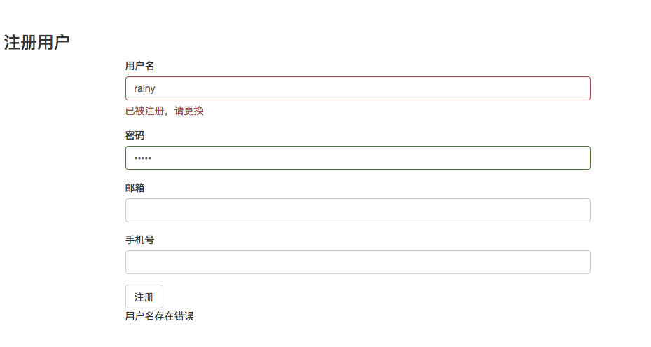

需求描述

1. 需要填写的信息：用户名、密码、手机号、邮箱。
2. 已被注册的用户名、手机号、邮箱，不能被再次注册。输入的信息如果不可用，在输入框右侧显示提示不可用信息。
3. 用户名、密码不能为空，手机号、邮箱可以为空。
4. 填写的信息未通过验证时，点击注册按钮后，提示错误信息，不提交表单。
5. 首页等其他页面的注册入口，点击后能跳转到注册页。
6. 点击“注册”，注册成功跳转到注册前的页面。

模块结构

```
表现层 mall-sso-web

- 前端
    - register.jsp 注册页面
- Controller
    - RegisterController
        - checkData() 验证数据是否可用
        - register() 注册用户

服务层 mall-sso

- mall-sso-interface
    - RegisterService
        - checkData() 验证用户名、手机号、邮箱是否可用
        - register() 注册用户
- mall-sso-service 接口的实现
```

处理逻辑

1. 输入用户名(手机号or邮箱)后（光标离开输入框），发送验证链接，验证是否可用。
    1. 用户名、密码的验证变量，初始状态为false，手机号、邮箱的初始状态为true，只有全部为true时，注册按钮可点。
    2. 验证后改变验证变量的值，手机号、邮箱为空时，验证变量是true。不为空时，去后段获得验证结果。
2. 点击注册按钮后，再次校验获取的信息，通过后将用户信息添加到数据库，密码需要加密。
3. 返回注册成功或失败的信息。注册成功后，提示注册成功，并跳转到登录页。
4. 其他页面的header里有登录注册入口，需要添加跳转逻辑。

测试

1. 输入空用户名(或全是空格)。提示用户名不能为空
2. 输入已被注册的用户名、手机号、邮箱。提示已被注册
3. 输入未被注册的用户名、密码。注册成功并跳转
4. 输入未被注册的用户名、密码、手机号、邮箱。注册成功并跳转
5. 使用工具构造用户名、密码为空，并注册。提示注册失败

### 登录

需求原型

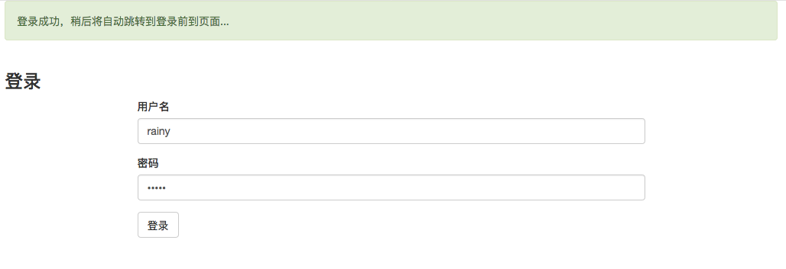

需求描述

1. 输入用户名和密码，验证通过后登录成功。用户名、密码不能为空
2. 访问不同的模块，如商城首页、搜索结果页，已登录的用户不用重新登录
3. 登录有过期时间，30分钟内没有操作，自动退出登录状态。有操作则维持登录状态。
4. 登录成功后，返回登录前的页面。如果登录前是注册页面，则返回注册前的页面。
5. 已登录用户，在状态栏上显示用户名、购物车、我的订单链接。

模块结构

```
- 表现层 mall-sso-web
    - 前端
        - login.jsp 登录页面
    - LoginController
        - login() 处理用户登录请求
        - getUserByToken() 检查用户是否登录
- 服务层 mall-sso
    - mall-sso-interface
        - LoginService
            - login() 处理登录逻辑
            - getUserByToken() 检查用户是否登录
    - mall-sso-service 接口的现实
```

代码逻辑

1. 页面：用户名和密码组成一个表单，点击“登录”按钮，将表单提交到Controller
2. 验证用户名和密码是否匹配。如果用户曾经登录过(token还没有过期），需要清除redis中对应的数据。
    1. 匹配。
        1. 生成key(随机生成)和value(用户名)，存入redis，代表session。
        2. 将key存入cookie返回给用户。
        3. 返回登录成功，跳转到登录前的页面。
    2. 不匹配，告知登录失败，停留在登录页面。
3. 登录成功后，再次访问需要登录的页面，该页面向后端传送token，检查redis中是否存在对应的key。
    1. 存在，则设置过期时间为30分钟（覆盖之前的时间），将用户信息传递给前端
    2. 不存在，将“用户未登录”信息传给前端
4. 登录成功后，前端查看是否有跳转链接，如果有，则跳转到对应页面。

测试用例

1. 不输入用户名、密码，点击“登录”，显示提示信息
2. 输入错误的用户名、密码，点击“登录”，提示登录失败
3. 输入正确的用户名、密码，点击“登录”，提示登录成功，
    1. 跳转到登录前的页面。
    2. 检查cookie携带的信息。
    3. 检查redis里信息是否添加成功。
4. 用工具构造空用户名、密码，发送请求，提示登录失败
5. 登录成功后，过10分钟，过30分钟，访问需要登录的页面。第一次可以访问，第二次退出登录。
6. 登录后检查需要登录的页面，看是否显示用户信息。

## 购物车

模块亮点

1. 使用Cookie和Redis存储购物车的内容。
2. 商品更新后，购物车内信息可以同步更新。

核心需求

1. 用户未登录时可以使用购物车，但不保证信息不会丢失
2. 用户登录后，如果登录前购物车里有信息，需要和登录后的购物车合并
3. 可以查看购物车的信息
4. 从购物车页面可以生成订单

模块结构

```
- 表现层
    - mall-protal-web 导航条有购物车入口
    - mall-cart-web 购物车页面
- 服务层
    - mall-cart
        - mall-cart-interface
        - mall-cart-service    
```

### 数据库设计

使用redis存储购物车数据。

购物车

- 数据结构 --- hset
- key   --- cart:用户id
- field --- 商品id
- value --- 商品数量

商品信息

- 数据结构 --- string
- key --- 商品id
- value --- 商品信息的json串

备注

也可以MySQL和redis结合使用。存入redis的购物车信息设置过期时间，redis中有数据时，从redis中获取，redis中无数据时，从数据库中获取。

### 加入购物车

需求原型

见商品详情页的"加入购物车"按钮

需求描述

1. 商品详情页，点击“添加到购物车”。
    1. 如果购物车里有该商品，将增加商品数量
    2. 如果没有，则将该商品添加到购物车

功能结构

```
- 静态页面
    - {itemId}.html “添加到购物车”入口
- 表现层 mall-cart-web
    - Controller
        - CartController
            - addToCart() 处理添加到购物车请求
- 服务层 mall-cart
    - mall-cart-interface
        - CartService
            - addToCart() 实现商品添加到购物车逻辑
    - mall-cart-service 接口的实现
```

处理逻辑

1. 点击“添加到购物车”后，使用ajax向CartController传递商品id、数量
2. CartController检查
  1. 商品是否存在，不存在则结束操作
  2. 用户是否登录
    1. 用户已登录则调用CartService服务，将商品添加到购物车。CartService从redis中获取用户的购物车信息，检查商品是否在购物车内
      1. 是，修改商品数量，更新redis里的信息
      2. 否。从数据库中查出商品信息，添加到购物车，更新redis里的信息
    2. 用户未登录，则获取cookie中的购物车信息，更新后重新添加到cookie
3. 将操作状态返回给前端

测试用例

1. 登录用户
  1. 购物车为空时，查看购物车页面
  2. 添加购物车中没有的商品，查看购物车页面
  3. 添加购物车中有的商品，查看购物车页面
2. 未登录用户
  1. 购物车为空时，查看购物车页面
  2. 添加购物车中没有的商品，查看购物车页面
  3. 添加购物车中有的商品，查看购物车页面

### 登录后合并购物车

需求描述

1. 用户未登录，且购物车里有商品，当用户登录后，需要将购物车和登录后的购物车合并。

功能结构

```
- 表现层 mall-sso-web
    - Controller
        - LoginController
            - login() 登录成功，合并购物车
- 服务层 mall-cart
    - mall-cart-interface
        - CartService
            - mergeCart() 合并购物车
    - mall-cart-service 实现interface里的接口
```

处理逻辑

1. 登录成功后，如果cookie中有购物车信息，则取出购物车列表，调用CartService服务

测试用例

1. 登录前购物车中有商品，查看登录后的购物车
2. 登录前购物车中没有商品，查看登录后的购物车

### 展示购物车

需求原型

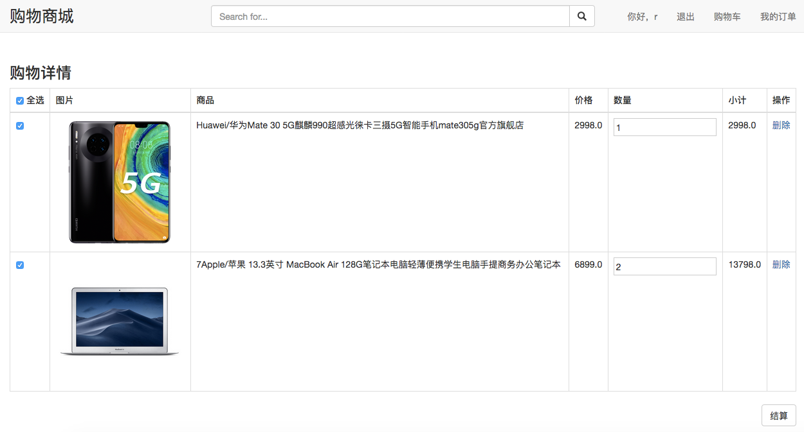

需求描述

1. 点击导航条上的“购物车”，可以跳转到购物车页面。
2. 购物车页面展示的内容有：选择框、商品名、商品图片、数量、单价、小计
3. 修改购物车中的商品数量时，失去焦点后，小计会自动更新。
4. 点击某个商品后的“删除”按钮，并在确认框内点击确认，删除对应的商品，并刷新购物车。
5. 如果商品数据有修改，刷新购物车页面，购物车内商品会发生变化。
6. 勾选“全选”框，所有商品都被选中；取消“全选”，所有商品都没被选中。

功能结构

```
- 表现层 mall-cart-web
    - 页面
        - cart.jsp 购物车页面
    - Controller
        - CartController
            - getCart() 获取购物车
            - deleteItemInCart() 删除购物车中的商品
            - updateItemInCart() 更新商品数量
- 服务层 mall-cart
    - mall-cart-interface
        - CartService
            - getCart() 获取redis中的购物车
            - deleteItemInCart() 删除购物车中的商品
            - updateItemInCart() 更新商品数量
    - mall-cart-service 实现interface中的接口
```

代码逻辑

- 加入购物车

1. 点击“加入购物车”后，将商品id和商品数量发送到Controller
2. Controller接收参数后，对参数进行有效性检查
3. 获取cookie中的token，判断用户是否登录
  1. 已登录
    1. 调用Service的服务将商品加入到购物车
    2. 从redis中查出购物车信息，商品在购物车中，则增加商品数量；商品不在购物车中，则购物车增加一项商品；
  2. 未登录，从cookie中获取购物车信息，将商品加入到购物车
    1. 商品在购物车中，则增加商品数量；商品不在购物车中，则购物车增加一项商品；
    2. 将修改后的购物车信息设置到 cookie 中
4. 将操作结果返回给用户

- 更新商品数量

1. 在购物车页面，修改商品数量，并将商品id和商品数量发送给Controller
2. Controller对参数进行有效性
3. Controller 根据cookie中的token调用loginService判断用户是否登录
  1. 已登录，调用service服务，更新redis中的购物车信息
  2. 未登录，未登录，从cookie中获取购物车信息，更新后重新设置cookie

- 删除商品

1. 在购物车页，点击商品项后的“删除”，将商品id发送给Controller
2. Controller判断用户是否登录
  1. 已登录，调用Service服务删除商品
  2. 未登录，从cookie中获取购物车信息，更新后重新设置cookie
3. 刷新前端页面

- 查看购物车信息

1. 点击“我的购物车”，调用Controller的getCart方法
2. Controller通过cookie中的token判断用户是否登录
  1. 已登录，调用Service服务获取购物车信息
    1. Service根据用户id，从redis中获取购物车信息
    2. 根据购物车中的商品id，尝试从redis中获取商品信息
      1. redis中没有，从mysql数据库中获取，并将商品信息存入redis（设置过期时间，防止信息只增不减）
      2. redis中有，从redis中获取商品信息的json串，并转换成商品对象。
    3. 将取得的商品列表返回
  2. 未登录，从cookie中获取购物车信息，调用Service获得商品的详细内容（同已登录的步骤2、3）
3. 将商品列表数据填入model，返回购物车页面

- 商品内容更新时

1. 商品删除或更新时，使用rabbitMQ通知CartService的MessageListener
2. MessageListener的onMessage方法将商品信息从购物车中删除

备注：如果删除一个商品，目前的效果是：刷新后，购物车中该商品消失。（待完善）

测试用例

以下几条，登录和未登录状态各测一遍。

1. 构造购物车数据，当购物车为空、有商品时，展示是否正确。
2. 删除购物车中的商品，查看购物车显示是否正确
3. 修改商品数量，查看购物车显示是否正确
4. 勾选“全选”，取消“全选”，看是否正确
5. 更新某商品后，刷新购物车页，看信息是否更新。
6. 删除某商品后，刷新购物车，查看商品是否消失

## 订单

模块亮点

1. 使用拦截器，确保只有登录用户才能进入订单页面。
2. 使用redis的incr命令生成订单号
3. 使用事务，保证订单和订单项一同添加成功

核心需求

1. 生成订单
2. 展示用户的订单
3. 支付后，订单状态变为已完成

模块结构

```
- 表现层
    - mall-order-web 订单页，支付页面
    - mall-cart-web 购物车，生成订单入口
- 服务层
    - mall-order 订单服务
        - mall-order-interface 订单服务的接口
        - mall-order-service 实现接口
    - mall-sso 登录注册服务
        - mall-sso-interface
        - mall-sso-service 实现接口
```

### 数据库设计

订单表

订单属性：订单号、实付金额、订单状态、下单时间、付款时间、发货时间、用户id

```sql
CREATE TABLE `mall_order` (
  `order_id` varchar(50)  NOT NULL DEFAULT '' COMMENT '订单id',
  `payment` varchar(50)  DEFAULT NULL COMMENT '实付金额。精确到2位小数;单位:元。如:200.07，表示:200元7分',
  `status` int(10) DEFAULT NULL COMMENT '状态：1、待付款，2、已完成',
  `create_time` datetime DEFAULT NULL COMMENT '订单创建时间',
  `payment_time` datetime DEFAULT NULL COMMENT '付款时间',
  `user_id` bigint(20) DEFAULT NULL COMMENT '用户id',
  PRIMARY KEY (`order_id`),
  FOREIGN KEY (`user_id`) REFERENCES `mall_user` (`id`)
);
```

订单项表

订单项属性：订单项id、商品id、商品数量、订单id、商品标题、商品单价、商品总金额、商品图片地址（冗余项是为了加快查询速度）

```sql
CREATE TABLE `mall_order_item` (
  `id` varchar(20)  NOT NULL,
  `item_id` bigint(20)  NOT NULL COMMENT '商品id',
  `order_id` varchar(50)  NOT NULL COMMENT '订单id',
  `num` int(10) DEFAULT NULL COMMENT '商品购买数量',
  `title` varchar(200)  DEFAULT NULL COMMENT '商品标题',
  `price` bigint(50) DEFAULT NULL COMMENT '商品单价',
  `total_fee` bigint(50) DEFAULT NULL COMMENT '商品总金额',
  `pic_path` varchar(200)  DEFAULT NULL COMMENT '商品图片地址',
  PRIMARY KEY (`id`),
  FOREIGN KEY (`item_id`) REFERENCES `mall_item` (`id`),
  FOREIGN KEY (`order_id`) REFERENCES `mall_order` (`order_id`)
);
```

redis数据库

订单编号(+1后获取最新的订单编号)

- key MALL_ORDER_ID
- value (String类型) 1000000000

### 生成订单

需求原型

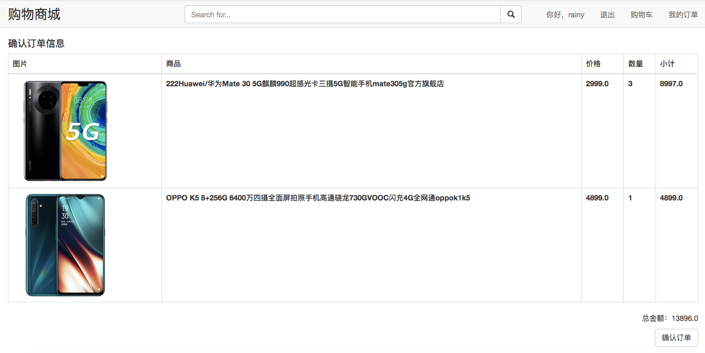

需求描述

1. 在购物车点击“结算”
    1. 至少选中了一件商品
        1. 用户已登录，生成订单，订单页显示选中的商品。
        2. 用户未登录，跳转到登录页面。登录成功后，跳转到订单页，并显示被选中的商品。
    2. 没有选中任何商品，则提示“请至少选中一件商品”。
2. 订单页展示内容：订单内容（商品项）、商品总价、“提交订单”按钮
3. 点击"提交订单"按钮，生成订单，清空购物车中对应的商品，走付款流程。
4. 付款页面显示的内容：订单号、总金额、付款按钮。
    1. 点击“确认支付”按钮，付款成功。
5. 当订单中没有商品时，跳转到购物车页面。

功能结构

```
- 表现层 mall-order-web
    - 页面
        - order.jsp 订单页
    - Controller
        - OrderController
            - showConfirmOrder() 展示订单页
            - addOrder() 生成订单并添加到数据库
- 服务层
    - mall-order
        - mall-order-interface 订单服务的接口
            - OrderService
                - addOrder() 生成订单并添加到数据库
        - mall-order-service 实现接口
    - mall-sso
        - mall-sso-interface
            - LoginService
                - getUserBytoken() 根据token获得用户信息
        - mall-sso-service 实现接口
```

代码逻辑

1. 点击“结算”，将被选中的商品id，以get方式传递给服务端。
2. 进入订单页前，使用拦截器判断用户是否登录
    1. 用户已登录，放行到订单页面，将用户信息传给Controller
    2. 用户未登录，构造重定向的url。保存当前页面的参数，当前页面的url，以get方式传递到下一个页面(登录页)
3. 进入Controller后
    1. 获取购物车中的商品信息。
    2. 根据被选中的商品id，筛选出购物车中的商品，传递到“确认订单页”
4. “确认订单页”展示订单信息。订单页有一个隐形的form，用来向后端传递订单信息。
    1. 点击“确认订单”按钮后，将订单信息传递到Controller
    2. Controller调用OrderService服务，生成订单和订单项，保存到数据库。
    3. Controller调用CartService服务，清空购物车中对应的商品。
    4. 将操作结果返回到前端
5. 走支付流程

测试用例

1. 未登录时，在购物车页面点击“结算”，检查是否跳转到登录页。
    1. 登录成功后，检查是否跳转到订单页
    2. 检查订单页显示的商品信息是否是选中的商品信息
2. 登录时，在购物车页面点击“结算”，检查是否跳转到“确认订单页”，页面显示的商品信息是否正确
3. 在订单页点击“提交订单”，检查订单是否成功录入数据库。检查购物车中是否清除了对应商品

### 展示订单列表

需求原型

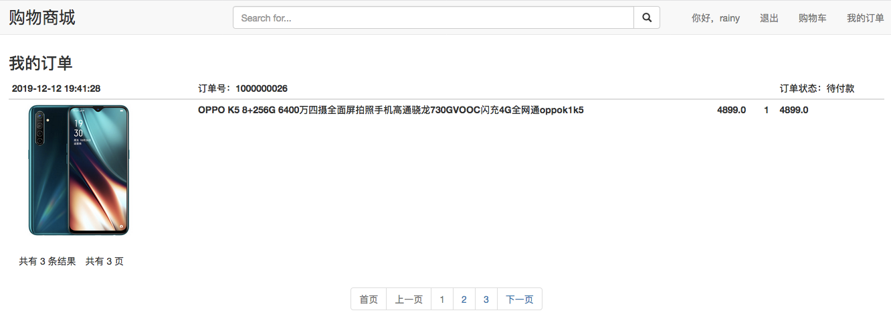

需求描述

1. 用户登录后，在导航条显示“我的订单”入口。
2. 点击“我的订单”，进入订单列表页。
  1. 订单按时间逆序排列
  2. 订单列表页展示内容如下：订单号，下单时间，订单状态，订单项，订单总金额。
3. 订单分页展示，每页显示15条订单。

功能结构

```
- 表现层 mall-order-web
  - 页面
    - order_list.jsp 订单列表页
  - Controller
    - OrderController 订单
- 服务层 mall-order
  - mall-order-interface
    - OrderService
      - getOrders() 根据用户id获得订单列表。
  - mall-order-service 实现接口
```

代码逻辑

1. 点击“我的订单”后，将用户id、页面号传递给OrderController。页面显示的条数，使用配置文件配置。
2. OderController调用OrderService
  1. OrderService 使用分页组件，调用getOrders获得订单列表
  2. getOrders调用getOrderItems将订单数据填充到OrderInfo对象
  3. 返回查询结果
3. 将数据传递给前端

测试用例

1. 检查未登录时，是否有“我的订单”入口
2. 登录后，点击“我的订单”，查看订单是否按时间逆序排序，订单项是否显示正确。
3. 点击翻页，看功能是否争取。

## 部署

亮点

1. 使用Nginx做静态服务器，存储商品详情页
2. 使用Nginx做反向代理服务器
3. 使用Maven的profile来控制开发环境和线上环境的切换
4. 使用maven远程部署到tomcat

Tomcat 远程部署注意事项

需要将本地ip配置到云服务器的安全组的出规则里，否则可能无法返回是否部署成功的信息
需要将manager的访问权限打开，因为默认只能本机的浏览器访问
tomcat除里需要修改Connector里的端口，还需要更改Server里的port


部署的命令 `clean tomcat7:redeploy -Pproduct -e`

先启动服务，再启动表现层


### 域名分配

| web表现层项目   | 域名   | Tomcat访问端口   | Tomcat远程停止服务端口|TomcatAJP端口|DubboQoS端口|
| ------------- | ----- | ---------- |---|---|----|
|内容管理后台首页 | manager.mall.rainyrun.top |8083/mall-manager|9003|8803|22222|
|购物商场首页     | www.mall.rainyrun.top     |8083|9003|8803|22223|
|商品详情         | item.mall.rainyrun.top    |8083/item|9003|8803|22229|
|搜索相关页面|search.mall.rainyrun.top|8083/search|9003|8803|22226|
|登录注册页面|sso.mall.rainyrun.top|8085/sso|9005|8805|22228|
|购物车页面|cart.mall.rainyrun.top|8085/cart|9005|8805|22231|
|订单页面|order.mall.rainyrun.top|8085/order|9005|8805|22233|
|图片服务器       | image.mall.rainyrun.top   | 8888 ||||

|web服务层项目|Tomcat访问端口| Tomcat远程停止服务端口 |TomcatAJP端口|DUBBOservice端口|DubboQoS端口|
|---|---|---|---|---|---|
|商品管理服务|8084|9004|8804|20880|22221|
|广告内容管理服务|8084/content|9004|8804|20881|22224|
|搜索服务|8084/search|9004|8804|20882|22225|
|登录注册服务|8084/sso|9004|8804|20883|22227|
|购物车服务|8084/cart|9004|8804|20884|22230|
|订单管理服务|8084/order|9004|8804|20885|22232|
|Solr搜索服务|8080||8005|||

### 出现问题

- JedisConnectionException: Unexpected end of stream. 

有3种可能

1. Redis 缓冲区不够。检查 redis.conf 中的 client-output-buffer-limit，设置为0表示关闭缓冲限制
2. 链接超时。检查 redis.conf 中的timeout。同一个 jedis 链接，两次访问 redis 服务的时间间隔 > timeout , 服务端会单方关闭这个jedis链接。
3. 在代码上增加重试机制

redis pool的配置，可以参考 [Redis工具类](https://www.cnblogs.com/antball/p/4976990.html)

- 内存不够，无法启动服务

每个tomcat实际占用内存接近300M，暂时没有找到降低内存占用的方法。只能将多个服务部署到一个tomcat上，减少内存的占用。

- redis.clients.jedis.exceptions.JedisConnectionException: java.net.SocketException: Broken pipe

第一次访问总出现上面的异常，之后就可以正常连接了。

- An invalid domain [.rainyrun.top] was specified for this cookie

设置cookie域名时，去掉域名前面的点即可，即 `rainyrun.top`


- 网页长时间加载不出来

经检查：服务正常，tomcat日志未报错。

可能是以下问题：

1. 域名解析没有正常解析。（测试直接用ip访问，访问正常，则是这个问题。可能是备案导致域名被锁）
2. 数据库事务卡死。（查看事务状态）
3. redis资源没有被释放。（检查代码是否close资源）

- 访问静态页面，nginx报403错误

用户权限问题，修改 `conf/nginx.conf` 改成 `user=root`

- 明明设置了cookie，但获取到cookie值为空

1. 检查是否跨域，是否设置了可跨域传递cookie
2. 检查是否存在同名cookie，但是cookie值为空


### 待解决

ajax请求，服务器设置cookie，响应能够看到set-cookie头部，但是cookie没有设置成功，刷新后消失。

tomcat在服务器内存不够的时候，会自动关闭。

sso-web，"/user/token/{token}" 设置response.setContentType("UTF-8")，不生效。改produces才生效。原因暂时不清楚。


数据库读写分离

数据库分表 mycat

使用binlog进行数据库同步


单点登录 SSO

CAS 开源解决方案


待解决

分布式ID生成器：twitter 雪花算法

二维码生成插件 qrious

## 调试中出现的问题汇总

### maven相关

- jar is missing

父POM增加了新的依赖管理，但是没有安装到仓库。导致子POM总提示版本找不到jar is missing.（看看仓库里是否有包）

- 引入了依赖但是找不到依赖包中的类

项目右键-->maven-->update project

- Failed to read artifact descriptor for xxx:jar

需要更新项目的依赖

项目右键-->maven-->update project-->勾选上force update of snapshots/releases

- class not found: xxx

检查是否含有包含该class的包，如果没有，则加入依赖。如果有，可能是包含该class的包，和依赖的某个包，版本不兼容。调整依赖包的版本即可。

### Zookeeper相关

- zookeeper 连接不上

CentOS中，检查zookeeper对应的端口是否开放

- zookeeper 启动不了

可能是版本不匹配，换个版本试一下

### Dubbo 相关

- SSLException

算不上错误，可以忽视，或者在数据库地址上加上 `useSSL=false`

- RemotingException: message can not send, because channel is closed

可能的原因：通信方式是主机+虚拟机。之前在联网状态开启了服务，Dubbo服务的ip地址是外网地址。后来在无网的情况下通信，导致的。

解决方法：方案一：重新打开网络。方案二：如果主机和虚拟机在无网情况下可以ping通(能通过内网ip通信)，可以在无网情况下，重新启动服务。

- Adrress already in use

检查provider的端口是否重复(是否都是20880)，两个服务不能使用同一个端口。

- Dubbo启动时qos-server can not bind localhost:22222错误解决

[解决方案](https://blog.csdn.net/u012988901/article/details/84503672)

### Tomcat 相关

- 端口被占用

在pom中的tomcat插件中，更换端口号。或者使用 `lsof -i:port` 查出占用该端口的进程的pid，使用 `kill -9 pid` 杀死进程。

- bug修改后未生效

maven的Tomcat插件启动后，不像本地tomcat会自动部署，需要重新启动。

### 数据库相关

- ClassNotFoundException: com.mysql.cj.jdbc.Driver

com.mysql.jdbc.Driver 是 mysql-connector-java 5中的
com.mysql.cj.jdbc.Driver 是 mysql-connector-java 6中的

不同MySQL版本对应不同的driver

- Date类型的对象，前端显示的和数据库内存储的不一致

JDBC连接 Mysql6 com.mysql.cj.jdbc.Driver，需要指定时区serverTimezone

`jdbc.url=jdbc:mysql://localhost:3306/mysql?useUnicode=true&characterEncoding=utf8&serverTimezone=GMT-8&useSSL=false`

- 插入中文显示??乱码

数据库默认的编码方式是latin1，需要修改编码

定位问题

```sh
# 查看数据库的编码方式
show variables like "character_set_%"
# 查看连接的编码方式
show variables like "collation_%";
```

解决问题

```sh

/*1*/
SET NAMES 'utf8';
/*
它相当于下面的三句指令： 
SET character_set_client = utf8; 
SET character_set_results = utf8; 
SET character_set_connection = utf8; 
*/

/*2*/
/*创建数据库的时候指定编码格式*/
MariaDB [lhc]> create database python_test character set utf8;


/*3*/
/*创建表的时候指定编码格式*/
MariaDB [lhc]> create table python_test(
    -> id int(11),
    -> name varchar(50) character set utf8,
    -> class_time int(11),
    -> PRIMARY KEY(id)
    -> )DEFAULT CHARSET=utf8;
    
    
    
/*修改某一个数据库*/
MariaDB [lhc]> ALTER database python_test character set utf8;

/*修改某一个表*/
MariaDB [lhc]> ALTER table python_test character set utf8;


set character_set_database=utf8;


添加配置文件

MySQL的配置文件为：my.cnf
路径一般在：/etc/my.cnf
如果没看到可以执行指令搜索：find / -name my.cnf
备注：没该文件MySQL也能正常启动，my.cnf的作用在于提供配置参数，不存在则使用默认参数（所以会导致编码问题），不存在该文件的同学只要新建一个到**/etc**下即可
添加文件内容

如果已有my.cnf文件，则在原有文件内容下添加
[client]
default-character-set=utf8
[mysqld]
default-storage-engine=INNODB
character-set-server=utf8
collation-server=utf8_general_ci


```

### pageHelper相关

- pageHelper 分页失效

检查配置是否正确

### 请求相关

- BadRequest(400)

可能是接受参数的Controller中，有两个名字相同的参数。如某个Pojo里的image属性，和请求里的MutipartFile image参数，有相同的名字image。

- Spring MVC控制器用@ResponseBody声明返回json数据报406的问题

具体错误：`406 Not Acceptable，message:description The resource identified by this request is only capable of generating responses with characteristics not acceptable according to the request "accept" headers ()`

### js相关

- 接受的json字符串使用时显示undefined

需要将json字符串转换成json对象

`var dataObj = eval("("+data+")");//转换为json对象`

- `$.cookie is not a function`

错误原因： 

1. 没有引入jquery.cookie.js文件，可在网上查找该文件。
2. 没有引入jQuery库文件。
3. jQuery库文件和jquery.cookie.js文件的顺序问题。须先引入jQuery库文件再引入cookie插件文件
4. 一个页面由于二次或多次引入了jquery插件导致。

### Sorl相关

配置信息更新后，记得重新加载内核，查看配置数据是否正确

出现 field not found 时，先检查字段配置的是否正确，再使用sorl admin查看使用的内核中的字段是否正确。

出现 Document contains at least one immense term 时，可以把对应字段的type从string改成text_general或者text_ik(中文分词器)

### redis相关

- Connection refused

1. 检查redis服务器地址配置是否正确
2. 检查redis是否开启
3. 检查虚拟机防火墙是否关闭，或者端口6379是否打开
4. 配置redis.conf，注释"bind 127.0.0.1"一行，将protected-mode改成no。并重启redis。或者加上"bind ip"，ip是redis服务器的ip地址

- redis服务长时间没有响应

查看之前的redis资源是否释放。redisPool获取资源后必须要手动释放。

### rabbitmq相关

- ClassNotFoundException: com.rabbitmq.client.QueueingConsumer

可能是引入版本出现了冲突。查看pom的dependency hierarchy，spring-rabbit包依赖的amqp-client和自己的引入发生了冲突，注释掉自己引用的即可（因为版本不匹配）。

### java相关

- No constructor found in ...

只定义了有参构造器，缺少无参构造器。

### Spring 相关

- 静态变量无法注入，报空指针错误

静态成员变量是在类加载的时候加载的，所以一直报空指针。

注入的方法见文档。

- 使用@ResponseBody注解，返回JSON数据时，前端页面显示406

这个问题有两个原因

1. 后台没有 jackson 的 jar 包，加上对应的jar包就ok。
2. 请求的路径是.html，web.xml中设置的spring前端控制器的拦截路径也设置的 `*.html`。controller中的方法添加了@ResponseBody注解，返回的类型可能是String，也可能是其他java类型，导致前端报406错误。

原因：.html这种请求路径比较特殊，springmvc不会给你返回一个json格式的数据类型，而是返回html格式的。

解决方法1：在web.xml文件中，更改前端控制器的拦截形式，如改成

```xml
<servlet-mapping>
    <servlet-name>wlss-web</servlet-name>
    <url-pattern>*.action</url-pattern>
</servlet-mapping>
```

解决方法2：使用Jackson等工具，自己转成json串，返回类型设为String。

- 拦截形式是`*.html` @ResponseBody返回中文字符串，中文变成??的问题

[解决方案](https://blog.csdn.net/wu1226419614/article/details/79356213)

### 日志相关

- linux服务器输出的日志，中文是??

这是由于本地语言环境导致，需要修改语言环境。

```sh
# 1. 增加utf8
vim /etc/locale.conf
LANG=zh_CN.utf8
# 2. 应用utf8
$ vim ~/.bashrc
# 追加
export LANG=utf8
export LC_ALL=zh_CN.utf8
export LC_CTYPE=zh_CN.utf8
# 3. 生效
source ~/.bashrc
# 4. 重启项目
```

### 路径问题汇总

前端页面上

1. 以"/"开头：相当于 `host:port/ 开头`
2. 不以"/"开头：相当于 `当前url的最后一个/ 开头`

后端部署描述符、java类上

1. 以"/"开头：相当于 `host:port/项目名/ 开头`
2. 不以"/"开头：相当于 `当前文件的目录/ 开头`
3. 以classpath:开头 相当于 `src目录/**`
4. 不以classpath:开头 相当于 `WebContent/`

### 待解决

衍生问题

1. 如何快速构建spring的测试环境，不用为了测试一个功能而一遍遍部署环境？
2. maven插件启动tomcat，在修改代码后，如何自动生效不用重新启动？
3. 如何一键填入测试数据，或者只需要填一次，下一次可以通过某个工具自动注入数据？

1. 某个web服务，缺少依赖的服务就无法启动成功，会报bug。但是它本身是一个完整的服务，只是某些功能不能用了。静态页面还是能用的。当某个服务不可用的时候，需要处理对应的异常页面

### 其他经验

1. null 和 "" 不相等，表单内的字段如果不填写，默认是""，没有该字段时，是null。
2. 调页面的时候，一定要留意控制台的信息，没有bug了再往下调。

### Nginx

我是在在本地用虚拟机中通过yum安装nginx的，安装一切正常，但是访问时报403，

于是查看nginx日志，路径为/var/log/nginx/error.log。打开日志发现报错Permission denied，详细报错如下：

```

1.    open() "/data/www/1.txt" failed (13: Permission denied), client: 192.168.1.194, server: www.web1.com, request: "GET /1.txt HTTP/1.1", host: "www.web1.com"
没有权限？于是找了不少资料，可以通过下面四步排查解决此问题。你可能只是其中之前配置有问题，不一定四个步骤都用上。

一、由于启动用户和nginx工作用户不一致所致
1.1查看nginx的启动用户，发现是nobody，而为是用root启动的

命令：ps aux | grep "nginx: worker process" | awk'{print $1}'
1.2将nginx.config的user改为和启动用户一致，

命令：vi conf/nginx.conf

二、缺少index.html或者index.php文件，就是配置文件中index index.html index.htm这行中的指定的文件。
1.    server {
2.      listen       80;
3.      server_name  localhost;
4.      index  index.php index.html;
5.      root  /data/www/;
6.    }
如果在/data/www/下面没有index.php,index.html的时候，直接文件，会报403 forbidden。

三、权限问题，如果nginx没有web目录的操作权限，也会出现403错误。
解决办法：修改web目录的读写权限，或者是把nginx的启动用户改成目录的所属用户，重启Nginx即可解决

1.    chmod -R 777 /data
2.    chmod -R 777 /data/www/
四、SELinux设置为开启状态（enabled）的原因。
4.1、查看当前selinux的状态。

1.    /usr/sbin/sestatus
4.2、将SELINUX=enforcing 修改为 SELINUX=disabled 状态。

1.    vi /etc/selinux/config
2.
3.    #SELINUX=enforcing
4.    SELINUX=disabled
4.3、重启生效。reboot。

1.    reboot
---------------------
```

## 总结

存在问题

1. 使用SessionId作为登录凭证，不安全（抓包获取到sessionid就能登录其他用户的账号）


